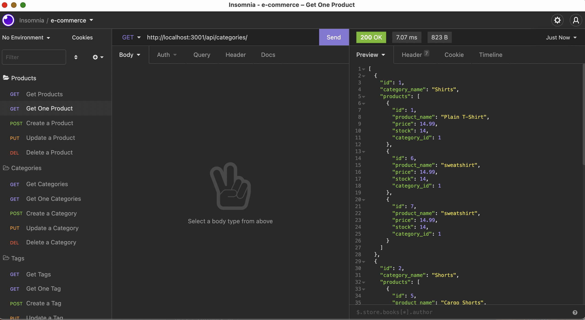

# E-Commerce-Back-End

## Description

As a manager at an internet retail company I want a back end for my e-commerce website that uses the latest technologies
so that my company can compete with other e-commerce companies.

## Table of Contents

- [Installation](#installation)
- [Usage](#usage)
- [Credits](#credits)
- [License](#license)

## Installation

I began by creating a uniquely named repo on Github and cloned the key to work locally. I then set up my initial folder structure with the given starter code. From there I added models, routes, seeded the data and got to work!

## Usage

    
    ```
[Link to video walk through](https://https://watch.screencastify.com/v/YWDMe619MgMULzwDTalF)    

## Credits

My tutor, Faran Navazi, as well as our recorded class sessions, assisted in the creation of this app.

## License

The last section of a high-quality README file is the license. This lets other developers know what they can and cannot do with your project. If you need help choosing a license, refer to [https://choosealicense.com/](https://choosealicense.com/).